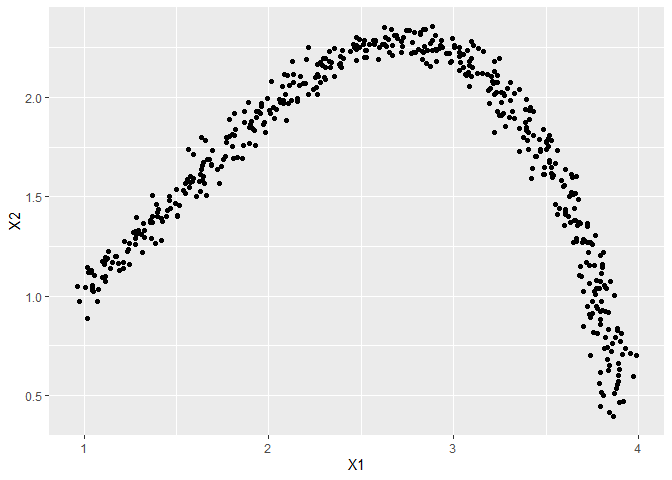
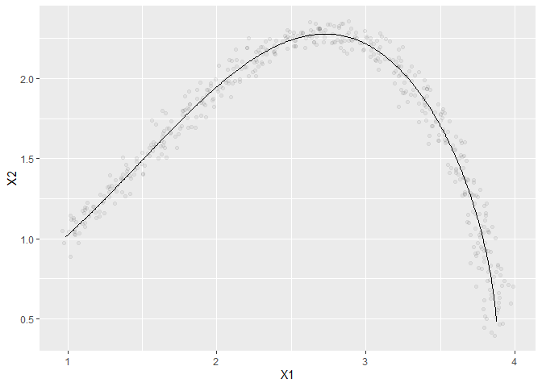
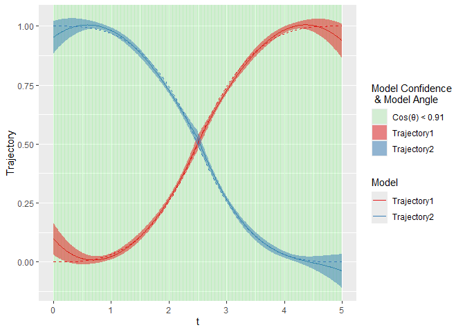

<!-- README.md is generated from README.Rmd. Please edit that file -->

# VFmixing

<!-- badges: start -->
<!-- badges: end -->

The goal of VFmixing is to provide methodology specifically designed to
mix vector fields given noisy positional data.

## Installation

You can install the development version of VFmixing from
[GitHub](https://github.com/) with:

``` r
# install.packages("pak")
pak::pak("jrodu/VFmixing")
```

## Example

This is an example showing how to use the main set of functions. Let’s
look at the noisy positional data from a particle moving through a some
unknown vector field.

``` r
library(VFmixing)

Data <- VFmixing::ExData
visualizeData(Data)
```



The key assumption for this method is that the true unknown vector field
is a linear combination of a set of simpler known vector fields at every
point in time. For this example, the set of mixing vector fields is a
rotational field and an expanding field. To use this set of vector
fields in the mixing process we construct the following function:

``` r
baseVectorFields
#> function (t, curPos) 
#> {
#>     f1 = c(curPos[2], -1 * curPos[1])/sqrt(sum(c(curPos[1], curPos[2])^2))
#>     f2 = c(curPos[1], curPos[2])/sqrt(sum(c(curPos[1], curPos[2])^2))
#>     matrix(c(f1, f2), nrow = 2, byrow = F)
#> }
#> <bytecode: 0x000001eb67224eb0>
#> <environment: namespace:VFmixing>
```

Now that the baseVectorFields function has been defined, we can begin
the mixing process. This is broken into two steps: Path and Trajectory.
The first step involves estimating the path the particle took through
the vector field. We do this to get better estimates of both position
and velocity that would otherwise be compromised extremely quickly with
only a small degree of error. We provide three unique methods to
estimate the path using cubic splines: ByFours, FullRegression, and
Projection. Each method has its pros and cons.

ByFours:  
Pros: Extremely Fast Computation and Great Estimates  
Con: No Theoretical Covariance Structure)

FullRegression:  
Pros: Great Estimates and Theoretical Covariance Structure  
Con: Slower Computation

Projection:  
Pros: Theoretical Covariance Structure and Reasonably Quick
Computation  
Con: Estimates can falter if the data is too complex

For complex real world scenarios, we recommend using the ByFours method,
but for this example we will showcase the Projection method as the data
is not too complex.

``` r

# EstPath <- getEstimatedPaths_Projection(Data = Data, nsplits = 100, 
#                                         V_Smooth = F, 
#                                         Model_Selection_Type = "BIC")

EstPath <- VFmixing::ExEstPath_Projection
visualizeEstPath(Data = Data, EstPath = EstPath, t_grid_size = 0.01, 
                 x_var = 'X1', y_var = 'X2')
```



With the path of the particle estimated, we can move to the main event:
the trajectory step. We want to estimate the weight functions for each
mixing vector field. We call the weight functions the Trajectory of each
field. Again, we provide a couple unique methods to estimate the
trajectory functions using cubic splines: ByFours and Optimization.
Similar to the ByFours path method, this method runs extremely fast,
outputs good estimates even with complex paths, but does not output a
theoretical covariance structure. The ByFours method can be used
regardless of which method was used to estimate the path. The
Optimization method uses the path covariance structure to transform the
path coefficients into the trajectory coefficients. This method has a
much higher computational cost and the estimates can sometimes falter
with complex paths, but yields a theoretical covariance structure under
the assumption that the mixing vector fields are relatively constant in
a small window defined by the path error. The Optimization method can
only be used if the path was estimated using the FullRegression or
Projection methods. In practice, we recommend using the ByFours method
again, simply due to the much lower computational cost, but since we
used the Projection methods for the path, we showcase the Optimization
method for the trajectories.

``` r

# EstTraj <- getEstimatedTrajectories_Optimization(EstPath = EstPath, 
#                                                  nsplits = 100,
#                                      baseVectorFields = baseVectorFields,
#                                      V_Smooth = F,
#                                      Model_Selection_Type = "BICOpt",
#                                      Random_Path = F)

EstTraj <- VFmixing::ExEstTraj_Optimization
TrueTraj <- VFmixing::ExTraj
visualizeEstTraj(EstTraj = EstTraj, TrueTraj = TrueTraj$Traj, 
                 TrueTrajTimeSplits = TrueTraj$TimeSplits, EstPath = EstPath, 
                 baseVectorFields = baseVectorFields, t_grid_size = 0.01, 
                 CL = 0.95, P_Int = T, Cos_Cutoff = 0.91)
```



In the plot above, we can see our estimate of the trajectory (solid
line) next to the true trajectories used to construct the data (dashed
line). Even with a reasonable amount of error in our data, visually, we
did pretty well and the confidence region captures a good percentage of
the true trajectory functions. However, we can use a couple more
functions to evaluate our method’s performance using the average squared
distance between the estimated trajectories and the truth, as well as
calculating the coverage rate of the trajectories.

``` r

AvgSqDist = cubicAvgSquareDist(EstCubic = EstTraj$Traj, 
                               TrueCubic = TrueTraj$Traj, 
                               EstTimeSplits = EstTraj$TimeSplits,
                               TrueTimeSplits = TrueTraj$TimeSplits, 
                               lower_bound = min(EstTraj$TimeSplits),
                               upper_bound = max(EstTraj$TimeSplits))
AvgSqDist
#> [1] 0.0003214484

TrajCovRate = coverageRateTraj(EstTraj = EstTraj, TrueTraj = TrueTraj$Traj, 
                               TrueTrajTimeSplits = TrueTraj$TimeSplits, 
                               CL = 0.95)
TrajCovRate
#> [1] 0.8003992
```

We can see that the average squared distance is extremely small, but the
coverage rate is lower than 95%, which we would’ve expected. Therefore,
the assumption that the mixing vector fields are constant within the
error region of a data point is not met, which we could have imagined
due to the nature of the vector fields and the amount of error in the
data.
