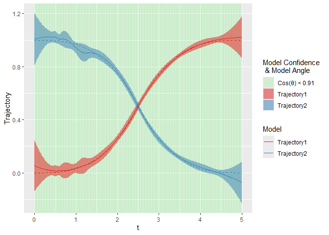

<!-- README.md is generated from README.Rmd. Please edit that file -->

# VFmixing

<!-- badges: start -->
<!-- badges: end -->

The goal of VFmixing is to provide methodology specifically designed to
mix vector fields given noisy positional data.

## Installation

You can install the development version of VFmixing from
[GitHub](https://github.com/) with:

``` r
# install.packages("pak")
pak::pak("jrodu/VFmixing")
```

## Example

This example shows how to use the main set of functions. Let’s look at
the noisy positional data from a particle moving through some unknown
vector field.

``` r
library(VFmixing)

Data <- VFmixing::ExData
visualizeData(Data)
```


The key assumption for this method is that the true unknown vector field
is a linear combination of a set of simpler known vector fields at every
point in time. For this example, the set of mixing vector fields is a
rotational field and an expanding field. To use this set of vector
fields in the mixing process we construct the following function:

``` r
baseVectorFields
#> function (t, curPos) 
#> {
#>     f1 = c(curPos[2], -1 * curPos[1])/sqrt(sum(c(curPos[1], curPos[2])^2))
#>     f2 = c(curPos[1], curPos[2])/sqrt(sum(c(curPos[1], curPos[2])^2))
#>     matrix(c(f1, f2), nrow = 2, byrow = F)
#> }
#> <bytecode: 0x0000021fb6c98f58>
#> <environment: namespace:VFmixing>
```

Now that the `baseVectorFields` function has been defined, we can begin
the mixing process. This is broken into two steps: Path and Trajectory.

### Step 1: Estimate the path

The first step estimates the path the particle took through the vector
field. We do this to get better estimates of both position and velocity,
which would otherwise be compromised extremely quickly with only a small
degree of error. The path is estimated with a cubic spline using
`getEstimatedPaths_FullFours()`.

The “FullFours” method works in two stages:

1.  The fast “ByFours” algorithm searches for the spline nodes. Each
    time a region is split, only the four neighboring segments are
    refit, so the search is extremely fast. By default, the number of
    nodes is chosen by BIC.
2.  A single full regression is then fit on the selected nodes. This
    gives stable estimates and an estimable covariance structure for the
    path.

The result is the speed of “ByFours” together with the covariance
structure needed for confidence intervals, random path draws, and the
“One-Shot” trajectory method below.

The criterion used to choose the nodes can be changed with
`Model_Selection_Type`. `"BIC"` (the default) and `"AIC"` are applied
directly to the “ByFours” candidates, so they stay fast. The
covariance-based criteria (`"BICVel"`, `"VarPos"`, `"VarVel"` and
`"VarPosVel"`) need a full regression on every candidate, so they are
slower. Every path method also takes a `patience` argument, which stops
the search once that many candidates in a row fail to improve the
criterion (see Step 2 for an example). It makes the biggest difference
with the slower criteria and with `getEstimatedPaths_FullRegression()`.

By default, every node search also *undersmooths*: it returns the
candidate with twice as many regions as the criterion selects (the “2x
BIC” rule, `undersmooth = TRUE`). The criterion balances fit against
complexity for the path’s positions, but the trajectories are estimated
from the path’s velocity, and at that level the velocity is biased: the
bias is small next to the positional noise, but large next to the
trajectories’ standard errors, so their intervals would undercover.
Twice the regions cuts that bias by roughly a factor of eight for a
modest increase in variance. With `patience`, the criterion’s choice is
fixed when patience runs out, and the search continues until it reaches
twice that many regions. Use `undersmooth = FALSE` for the criterion’s
own choice.

``` r
PathTime <- system.time(
  EstPath <- getEstimatedPaths_FullFours(Data = Data, nsplits = 100)
)
```

The run time, in seconds:

``` r
PathTime
#>    user  system elapsed 
#>    0.36    0.03    0.46
```

Because the “FullFours” path has a covariance structure, the plot can
show its uncertainty. By default these are 95% prediction intervals for
a new observation: the uncertainty in the fitted path plus the
observation noise (`P_Int = FALSE` shows a confidence interval for the
path itself instead). When both axes are positions, the shaded tube is
the joint 95% region for both coordinates, swept along the path:

``` r
visualizeEstPath(Data = Data, EstPath = EstPath, t_grid_size = 0.01,
                 x_var = 'X1', y_var = 'X2')
```


With time on one axis, the interval is drawn as a band:

``` r
visualizeEstPath(Data = Data, EstPath = EstPath, t_grid_size = 0.01,
                 x_var = 't', y_var = 'X1')
```


We can also check how well this uncertainty is calibrated.
`coverageRatePath()` uses the same 95% prediction intervals at each data
time and reports, for each dimension, the share of data points that fall
inside them.

``` r
PathCovRate = coverageRatePath(EstPath = EstPath, Data = Data, CL = 0.95)
PathCovRate
#> [1] 0.9441118 0.9620758
```

The coverage rates for X1 and X2 are 94.4% and 96.2%, near the nominal
95%.

The package includes the BIC version of this path
(`undersmooth = FALSE`) as `ExEstPath_FullFours`.

<details>
<summary>
Other path methods
</summary>

The package also provides the methods that “FullFours” is built from.
They are mainly useful for comparison:

- `getEstimatedPaths_ByFours()`: the node search on its own. Very fast,
  but without a covariance structure.
- `getEstimatedPaths_FullRegression()`: refits the full spline at every
  split. Has a covariance structure, but is much slower.
- `getEstimatedPaths_Projection()`: fits each region separately and
  projects onto the smooth spline space. Has a covariance structure, but
  estimates can be unstable for very complex data.

</details>

### Step 2: Estimate the trajectories

With the path of the particle estimated, we can move to the main event:
the trajectory step. We want to estimate the weight functions for each
mixing vector field. We call the weight functions the Trajectory of each
field. These are also estimated with cubic splines.

Because the “FullFours” path has a covariance structure, we can use the
“One-Shot” method. It uses the path covariance structure to transform
the path coefficients into the trajectory coefficients, which yields a
theoretical covariance structure for the trajectories under the
assumption that the mixing vector fields are relatively constant in a
small window defined by the path error. A faster alternative without a
covariance structure is `getEstimatedTrajectories_ByFours()`.

The trajectory node search undersmooths in the same way by default
(twice the regions BIC selects). A trajectory spline whose nodes don’t
line up with the truth’s can’t follow it exactly; the extra regions let
it bend between misplaced nodes.

``` r
TrajTime <- system.time(
  EstTraj <- getEstimatedTrajectories_OneShot(EstPath = EstPath, nsplits = 100,
                                              baseVectorFields = baseVectorFields)
)
```

The run time, in seconds:

``` r
TrajTime
#>    user  system elapsed 
#>    6.21    0.32    6.73
```

By default, every candidate up to `nsplits` is fit before the best one
is chosen. The `patience` argument stops the search once that many
candidates in a row have failed to improve the selection criterion. This
is much faster when the best model has few regions, but it can miss a
better model that would only appear after a long run without
improvement, so it is off by default.

``` r
PatienceTime <- system.time(
  EstTrajPatience <- getEstimatedTrajectories_OneShot(EstPath = EstPath, nsplits = 100,
                                                      baseVectorFields = baseVectorFields,
                                                      patience = 10)
)
```

``` r
PatienceTime
#>    user  system elapsed 
#>    0.03    0.00    0.05

# Same trajectory as the full search?
isTRUE(all.equal(EstTrajPatience$Traj, EstTraj$Traj))
#> [1] TRUE
```

``` r
TrueTraj <- VFmixing::ExTraj
visualizeEstTraj(EstTraj = EstTraj, TrueTraj = TrueTraj$Traj,
                 TrueTrajTimeSplits = TrueTraj$TimeSplits, EstPath = EstPath,
                 baseVectorFields = baseVectorFields, t_grid_size = 0.01,
                 CL = 0.95, Cos_Cutoff = 0.91)
```


In the plot above, we can see our estimate of the trajectory (solid
line) next to the true trajectories used to construct the data (dashed
line). We can evaluate the method’s performance more formally using the
average squared distance between the estimated trajectories and the
truth, as well as the coverage rate of each trajectory’s 95% intervals.

``` r
AvgSqDist = cubicAvgSquareDist(EstCubic = EstTraj$Traj,
                               TrueCubic = TrueTraj$Traj,
                               EstTimeSplits = EstTraj$TimeSplits,
                               TrueTimeSplits = TrueTraj$TimeSplits,
                               lower_bound = min(EstTraj$TimeSplits),
                               upper_bound = max(EstTraj$TimeSplits))
AvgSqDist
#> [1] 0.0002711353

TrajCovRate = coverageRateTraj(EstTraj = EstTraj, TrueTraj = TrueTraj$Traj,
                               TrueTrajTimeSplits = TrueTraj$TimeSplits,
                               CL = 0.95)
TrajCovRate
#> [1] 1 1
```

The average squared distance is extremely small, and the coverage rates
for the two trajectories are 100% and 100%, at or above the nominal 95%.
For this example the intervals are, if anything, conservative.

### The full method, with the node-selection uncertainty

`getEstimatedTrajectories_Full()` runs both steps on the data in one
call (“FullFours” path, then “One-Shot” trajectories, both undersmoothed
by default). One-Shot’s covariance treats the selected nodes as fixed,
but they are chosen from the data, so they would vary from data set to
data set. With `bootstrap = TRUE`, that extra uncertainty is added
through the law of total variance:

$$\mathrm{Var}(\hat\beta) = \underbrace{E[\mathrm{Var}(\hat\beta \mid \text{nodes})]}_{\text{One-Shot's covariance}} + \underbrace{\mathrm{Var}(E[\hat\beta \mid \text{nodes}])}_{\text{node selection}}$$

One-Shot provides the first part exactly. For the second, a residual
bootstrap reruns both node searches on `B` resampled data sets, then
fits each replicate’s nodes, without noise, to the fitted path: the
spread of those fits is the node-selection variance. Because those fits
have no noise in them, a small `B` (20 by default) is enough.

``` r
set.seed(1)
FullTime <- system.time(
  Fit <- getEstimatedTrajectories_Full(Data = Data, baseVectorFields = baseVectorFields,
                                       traj_nsplits = 100, bootstrap = TRUE, B = 20,
                                       quiet = TRUE)
)
```

The run time, in seconds, with 20 bootstrap replicates:

``` r
FullTime
#>    user  system elapsed 
#>    1.78    0.06    1.96
```

The returned trajectory’s `Cov` is the total, so the plotting and
coverage functions use the full uncertainty. The separate pieces are
kept in `Fit$Variance`, including the pointwise variances on a time
grid:

``` r
head(Fit$Variance$Pointwise)
#>      t trajectory  var_within var_selection   var_total selection_share
#> 1 0.00          1 0.009726079  1.256212e-05 0.009738641    0.0012899254
#> 2 0.01          1 0.009121248  1.048822e-05 0.009131737    0.0011485462
#> 3 0.02          1 0.008547730  8.669058e-06 0.008556400    0.0010131666
#> 4 0.03          1 0.008004074  7.083549e-06 0.008011158    0.0008842103
#> 5 0.04          1 0.007488898  5.711781e-06 0.007494610    0.0007621185
#> 6 0.05          1 0.007000885  4.534970e-06 0.007005420    0.0006473517

# Average share of the trajectory variance that comes from the node selection
aggregate(selection_share ~ trajectory, data = Fit$Variance$Pointwise, FUN = mean)
#>   trajectory selection_share
#> 1          1      0.01041117
#> 2          2      0.05867149
```

Coverage of the true trajectories with One-Shot’s covariance alone, and
with the node-selection part added:

``` r
OneShotOnly <- Fit$EstTraj
OneShotOnly$Cov <- Fit$Variance$Within

coverageRateTraj(OneShotOnly, TrueTraj$Traj, TrueTraj$TimeSplits, CL = 0.95)
#> [1] 1 1
coverageRateTraj(Fit$EstTraj, TrueTraj$Traj, TrueTraj$TimeSplits, CL = 0.95)
#> [1] 1 1
```

``` r
visualizeEstTraj(EstTraj = Fit$EstTraj, TrueTraj = TrueTraj$Traj,
                 TrueTrajTimeSplits = TrueTraj$TimeSplits, EstPath = Fit$EstPath,
                 baseVectorFields = baseVectorFields, t_grid_size = 0.01,
                 CL = 0.95, Cos_Cutoff = 0.91)
```



The selection part still conditions on the base vector fields evaluated
along the estimated path, so the error from the path position in those
evaluations is not included.

## Simulation studies

Each study is one self-contained function that runs one fully seeded
replicate and returns its data, fits and metrics. A matching script in
`inst/simulations/` runs seeds 1 to 100, saving one file per seed so a
run can be stopped and resumed, or split across machines by seed.

| Study | Vector fields | Settings | Variants |
|----|----|----|----|
| `runSimulationStudy_Axis2D()` | constant (0, 1) and (1, 0) | 3 error levels x 3 complexities | BIC, 2x BIC on the path only, 2x BIC, 2x BIC + bootstrap |
| `runSimulationStudy_RotationExpansion2D()` | unit rotation and expansion | 3 error levels x 3 complexities | 2x BIC + bootstrap |
| `runSimulationStudy_Lorenz3D()` | Lorenz field and two orthogonal companions | 3 error levels x 3 complexities | 2x BIC + bootstrap |
| `runSimulationStudy_Collinearity2D()` | x-axis and a field at a random angle | low error, medium complexity | 2x BIC + bootstrap |
| `runSimulationStudy_ErrorProcess2D()` | rotation and expansion, noisy velocity at a random SNR | low error, medium complexity | 2x BIC + bootstrap |
| `runSimulationStudy_Misspecification2D()` | data from rotation and expansion, fit with scaled versions | low error, medium complexity | 2x BIC + bootstrap |
| `runSimulationStudy_Continuity2D()` | random gridded fields, nearest / bilinear / bicubic | low error, medium complexity, 3 continuities | 2x BIC + bootstrap |

The Axis study isolates the effect of each piece: the fields are
constant, so any undercoverage comes from the bias and the node
selection rather than from evaluating the fields along an estimated
path.

``` r
run <- runSimulationStudy_Axis2D(seed = 1, keep_fits = FALSE)
run$Results
```
